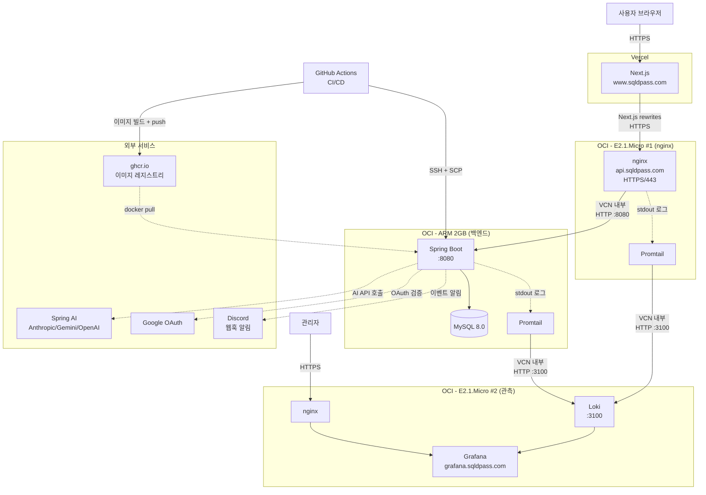

# sqldpass - 구현 현황
> 최종 업데이트: 2026-04-06

## 프로젝트 개요
SQLD 자격증 문제집 사이트 — AI 문제 생성, 풀이, 채점, 오답 분석 기능 제공

- 운영: https://www.sqldpass.com (프론트), https://api.sqldpass.com (백엔드)
- 모니터링: https://grafana.sqldpass.com (Loki + Grafana)

## 기술 스택
- **Frontend:** Next.js 16.2.2 (App Router), React 19, TypeScript 5, Tailwind CSS 4
- **Backend:** Java 21, Spring Boot 4.0.5, Gradle, Spring Data JPA, Jackson 3
- **DB:** MySQL 8.0 (Docker), H2 (테스트), Flyway (마이그레이션)
- **AI:** Spring AI (Anthropic, Google GenAI, OpenAI) — 문제 자동 생성
- **인증:** Google OAuth 2.0 + JWT, BCrypt (관리자 비밀번호)
- **문서:** springdoc-openapi (Swagger UI)
- **Infra:** OCI (3 인스턴스: ARM 백엔드 + E2 nginx + E2 Loki), Vercel (프론트), GitHub Actions, ghcr.io
- **알림:** Discord 웹훅 (문제 생성, 신규 가입, 서버 예외)
- **로깅:** Loki + Grafana (14일 retention) + Promtail (Docker 로그 자동 수집)

## 운영 인프라 아키텍처



## 데이터 흐름 — 주요 시나리오

### 1. 사용자 문제 풀이
```
브라우저 → Vercel(Next.js) → /api/* rewrites → nginx(443) → ARM 백엔드(8080) → MySQL
```

### 2. AI 문제 생성 (관리자)
```
관리자 → /admin/generate POST → QuestionGenerationService(비동기)
   → Spring AI(Claude/Gemini/OpenAI) → DB save
   → Discord 웹훅 알림 (#sqldpass-문제생성)
```

### 3. 신규 회원 가입
```
브라우저 → Google OAuth → AuthService.loginWithGoogle()
   → memberRepository.save() (신규일 때만)
   → Discord 웹훅 알림 (#sqldpass-신규가입)
```

### 4. 서버 예외 발생
```
요청 → 컨트롤러 → 예외 → GlobalExceptionHandler.handleException()
   → log.error (stdout) → Promtail → Loki → Grafana
   → Discord 웹훅 알림 (#sqldpass-서버에러)
```

### 5. 배포 (CI/CD)
```
git push (main) → GitHub Actions
   → Gradle 테스트 → Docker 빌드(ARM64) → ghcr.io push
   → SCP docker-compose.prod.yaml → ARM 서버
   → SSH: docker compose pull && up -d → /actuator/health 헬스체크
```

## 구현 완료

### 백엔드
- [x] 과목 트리 조회 API (관련 파일: `backend/.../controller/subject/`)
- [x] 문제 랜덤 조회 / 상세 조회 API (관련 파일: `backend/.../controller/question/`)
- [x] 답안 제출 + 채점 API (관련 파일: `backend/.../controller/solve/`)
- [x] 풀이 기록 목록 / 상세 조회 API (관련 파일: `backend/.../controller/solve/`)
- [x] 오답 문제 목록 / 취약 영역 통계 API (관련 파일: `backend/.../controller/wronganswer/`)
- [x] Google OAuth 소셜 로그인 + JWT 인증 (관련 파일: `backend/.../controller/auth/`, `backend/.../service/auth/`)
- [x] 관리자 로그인 (BCrypt + JWT) (관련 파일: `backend/.../controller/admin/AdminAuthController.java`)
- [x] 관리자 문제 CRUD API (관련 파일: `backend/.../controller/admin/AdminQuestionController.java`)
- [x] 관리자 회원 목록 API (관련 파일: `backend/.../controller/admin/AdminMemberController.java`)
- [x] 관리자 통계 대시보드 API (관련 파일: `backend/.../controller/admin/AdminStatsController.java`)
- [x] AI 문제 생성 — 토픽 기반, Few-shot 예시, 백그라운드 실행 (관련 파일: `backend/.../service/generation/`)
- [x] 문제 생성 동시 실행 방지 (DB Lock) (관련 파일: `backend/.../service/generation/GenerationLockService.java`)
- [x] Flyway DB 마이그레이션 (관련 파일: `backend/src/main/resources/db/migration/`)
- [x] 테스트 14개 (Service + Controller)

### 프론트엔드
- [x] 랜딩 페이지 — 히어로, 피처 카드, 라이브 문제 미리보기 (관련 파일: `frontend/src/app/page.tsx`)
- [x] 문제 풀기 페이지 — 과목 선택 → 풀이 → 채점 + 문제별 즉시 제출 (관련 파일: `frontend/src/app/solve/page.tsx`)
- [x] 학습 대시보드 — 정답률, 연속 학습일, 과목별 통계, 취약 영역, 최근 2주 활동 (관련 파일: `frontend/src/app/dashboard/page.tsx`)
- [x] 풀이 기록 상세 페이지 (관련 파일: `frontend/src/app/history/[id]/page.tsx`)
- [x] 오답 노트 페이지 — 과목별 필터, 통계, 아코디언 (관련 파일: `frontend/src/app/wrong-answers/page.tsx`)
- [x] Google OAuth 로그인 콜백 (관련 파일: `frontend/src/app/auth/callback/google/page.tsx`)
- [x] 로그인 가드 — /solve, /dashboard, /wrong-answers 비로그인 시 로그인 유도 (관련 파일: `frontend/src/components/LoginRequired.tsx`)
- [x] Google 소셜 로그인 버튼 — NavBar + LoginRequired에 Google 로고 표시 (관련 파일: `frontend/src/components/NavBar.tsx`)
- [x] 관리자 대시보드 (관련 파일: `frontend/src/app/admin/page.tsx`)
- [x] 관리자 로그인 (관련 파일: `frontend/src/app/admin/login/page.tsx`)
- [x] 관리자 문제 관리 + 편집 (관련 파일: `frontend/src/app/admin/questions/`)
- [x] 관리자 회원 관리 (관련 파일: `frontend/src/app/admin/members/page.tsx`)
- [x] 관리자 AI 문제 생성 UI + 폴링 (관련 파일: `frontend/src/app/admin/generate/page.tsx`)
- [x] 네비게이션 바 — 모바일 대응, 테마 토글, Google 로그인/로그아웃 (관련 파일: `frontend/src/components/NavBar.tsx`)
- [x] 다크/라이트 모드 토글 (관련 파일: `frontend/src/lib/theme.ts`)
- [x] 문제 콘텐츠 파서 — SQL 코드 블록, 정보 블록 (관련 파일: `frontend/src/lib/parseQuestion.ts`)
- [x] SVG 파비콘 (관련 파일: `frontend/public/`)

### 인프라 / 배포
- [x] Dockerfile — 멀티스테이지 빌드, 비루트 사용자, JRE Alpine, ARM64 (`backend/Dockerfile`)
- [x] 운영 Docker Compose — app + MySQL, DB 포트 미노출, 메모리 1G/512M (`docker-compose.prod.yaml`)
- [x] GitHub Actions CI — PR 시 테스트 자동 실행 (`.github/workflows/ci.yml`)
- [x] GitHub Actions CD — 빌드 → ghcr.io 푸시 → SCP → SSH 배포 → 헬스체크 (`.github/workflows/cd.yml`)
- [x] OCI ARM 인스턴스 Docker 배포 (백엔드 + MySQL 같은 인스턴스)
- [x] 시크릿 관리 — GitHub Secrets → SSH envs로 직접 전달 (.env 파일 미사용)
- [x] Actuator health 엔드포인트 노출 (운영 헬스체크용)
- [x] **nginx 리버스 프록시 + Let's Encrypt HTTPS** — `api.sqldpass.com` (E2.1.Micro #1, `proxy/`)
- [x] **백엔드 8080 외부 차단** — VCN 내부에서 nginx만 접근

### 알림 / 모니터링
- [x] **Discord 웹훅 알림** — 3개 채널 분리 (`backend/.../service/notification/DiscordNotifier.java`)
  - 문제 생성 완료: 결과 통계 + 생성 문제 미리보기
  - 신규 회원 가입: 닉네임, provider
  - 서버 예외: 스택트레이스, 요청 경로 (404 등 노이즈 필터링)
- [x] **Loki + Grafana 로깅 플랫폼** (E2.1.Micro #2, `observability/`)
  - 14일 자동 retention
  - `grafana.sqldpass.com` HTTPS
  - 백엔드 + nginx + Hibernate 슬로우 쿼리(1초 임계) 수집
  - Promtail (ARM, E2 #1)이 Docker 로그 자동 수집 → Loki push

## 진행 중
- (없음)

## TODO
- [ ] 회원 프로필 API (GET/PATCH /api/members/me)
- [ ] Grafana 대시보드 구축 (UI에서 직접)

## DB 테이블

| 테이블 | 설명 | 마이그레이션 |
|--------|------|-------------|
| member | 회원 (OAuth — provider, providerId, nickname) | V1 |
| subject | 과목 (트리 구조, self-referential) | V1 + V2(시드) |
| question | 문제 (content, correct_option, explanation, summary, topic, difficulty) | V1 + V3(단순화) |
| solve | 풀이 회차 (member, subject, 점수) | V4 |
| solve_answer | 회차별 개별 답안 (선택/정답 번호, 정답 여부) | V4 |
| generation_lock | 문제 생성 동시 실행 방지 (싱글톤 row, status: IDLE/RUNNING/COMPLETED/FAILED) | - |

## 레이어 규칙

```
[조회] DB → Entity → Mapper → Domain → Service → Controller → Response DTO (record)
[저장] Request DTO → Service → Entity 직접 생성 → DB
```

- Domain ↔ Entity 서로 import 금지
- Mapper는 `persistent/` 패키지, Entity → Domain 단방향만
- DTO는 Java record, `controller/` 패키지에 위치

## 테스트 (14개)

| 테스트 | 방식 | 개수 |
|--------|------|------|
| SubjectServiceTest | @SpringBootTest + H2 | 2 |
| SubjectControllerTest | @WebMvcTest + MockitoBean | 2 |
| QuestionServiceTest | @SpringBootTest + H2 | 3 |
| QuestionControllerTest | @WebMvcTest + MockitoBean | 3 |
| SolveServiceTest | @SpringBootTest + H2 | 2 |
| SolveControllerTest | @WebMvcTest + MockitoBean | 2 |

## 프로젝트 구조
```
sqldpass/
├── backend/
│   ├── Dockerfile                        # 멀티스테이지 ARM64
│   └── src/main/java/com/sqldpass/
│       ├── config/                       # JpaConfig, WebConfig, AdminAuthInterceptor 등
│       ├── controller/
│       │   ├── admin/                    # AdminAuth, AdminQuestion, AdminMember, AdminStats, AdminGeneration
│       │   ├── auth/                     # AuthController (Google OAuth)
│       │   ├── common/                   # ErrorResponse, GlobalExceptionHandler
│       │   ├── question/                 # QuestionController + DTO
│       │   ├── solve/                    # SolveController + DTO
│       │   ├── subject/                  # SubjectController + DTO
│       │   └── wronganswer/              # WrongAnswerController + DTO
│       ├── service/
│       │   ├── admin/                    # AdminMember, AdminQuestion, AdminStats, JwtProvider
│       │   ├── auth/                     # AuthService, GoogleOAuthClient
│       │   ├── generation/               # QuestionGenerationService, GenerationLockService, Scheduler
│       │   ├── notification/             # DiscordNotifier (3채널 알림)
│       │   ├── question/                 # QuestionService
│       │   ├── solve/                    # SolveService
│       │   ├── subject/                  # SubjectService
│       │   └── wronganswer/              # WrongAnswerService
│       ├── domain/                       # 순수 도메인 모델 (Member, Question, Solve, Subject)
│       └── persistent/                   # JPA Entity, Repository, Mapper
├── frontend/
│   └── src/
│       ├── app/
│       │   ├── page.tsx                  # 랜딩
│       │   ├── solve/page.tsx            # 문제 풀기
│       │   ├── dashboard/page.tsx        # 학습 대시보드
│       │   ├── history/[id]/page.tsx     # 풀이 상세
│       │   ├── wrong-answers/page.tsx    # 오답 노트
│       │   ├── auth/callback/google/     # OAuth 콜백
│       │   └── admin/                    # 관리자
│       ├── components/                   # NavBar, LoginRequired, QuestionContent, ScrollReveal, Spinner
│       └── lib/                          # api, adminApi, auth, oauth, theme, parseQuestion, format
├── proxy/                                # E2 #1 nginx 리버스 프록시
│   ├── docker-compose.yml
│   ├── nginx.conf                        # api.sqldpass.com → ARM:8080
│   └── README.md
├── observability/                        # E2 #2 Loki + Grafana
│   ├── docker-compose.yml
│   ├── loki-config.yml                   # 14일 retention
│   ├── nginx.conf                        # grafana.sqldpass.com
│   ├── promtail-compose.yml              # ARM, E2 #1에 배포
│   ├── promtail-config.yml
│   └── README.md
├── .github/workflows/
│   ├── ci.yml                            # PR 테스트
│   └── cd.yml                            # main push 배포
├── docs/
│   └── PROGRESS.md                       # 이 파일
├── docker-compose.yaml                   # 로컬 MySQL 8.0 (포트 3307)
├── docker-compose.prod.yaml              # ARM 운영 (백엔드 + MySQL)
└── CLAUDE.md
```

## API 엔드포인트

### 공개 API
| Method | Path | 설명 | 인증 |
|--------|------|------|------|
| GET | `/api/subjects` | 과목 트리 조회 | - |
| GET | `/api/questions?subjectId&size` | 과목별 랜덤 문제 (정답 미포함) | - |
| GET | `/api/questions/{id}` | 문제 상세 (정답+해설) | - |
| POST | `/api/solves` | 답안 제출 + 채점 | JWT |
| GET | `/api/solves` | 내 풀이 기록 | JWT |
| GET | `/api/solves/{id}` | 풀이 상세 | - |
| GET | `/api/wrong-answers?subjectId` | 오답 문제 목록 | JWT |
| GET | `/api/wrong-answers/stats` | 취약 영역 통계 | JWT |
| POST | `/api/auth/login/google` | Google OAuth 로그인 | - |

### 관리자 API
| Method | Path | 설명 | 인증 |
|--------|------|------|------|
| POST | `/api/admin/login` | 관리자 로그인 | - |
| GET | `/api/admin/stats` | 통계 대시보드 | Admin JWT |
| GET | `/api/admin/questions?subjectId&page&size` | 문제 목록 (페이지네이션) | Admin JWT |
| GET | `/api/admin/questions/{id}` | 문제 상세 | Admin JWT |
| PUT | `/api/admin/questions/{id}` | 문제 수정 | Admin JWT |
| DELETE | `/api/admin/questions/{id}` | 문제 삭제 | Admin JWT |
| GET | `/api/admin/members?page&size` | 회원 목록 | Admin JWT |
| POST | `/api/admin/generate?count` | AI 문제 생성 시작 | Admin JWT |
| GET | `/api/admin/generate/status` | 생성 상태 조회 | Admin JWT |
| POST | `/api/admin/generate/reset` | 생성 상태 초기화 | Admin JWT |

## 페이지/컴포넌트

### 사용자 페이지
| 경로 | 설명 | 인증 | 상태 |
|------|------|------|------|
| `/` | 랜딩 페이지 (히어로, 피처, CTA) | - | 완료 |
| `/solve` | 과목 선택 → 문제 풀기 → 문제별 즉시 채점/제출 | 필수 | 완료 |
| `/dashboard` | 학습 대시보드 (정답률, 연속학습, 과목별 통계, 취약영역) | 필수 | 완료 |
| `/history/[id]` | 풀이 기록 상세 (문제별 정오답) | - | 완료 |
| `/wrong-answers` | 오답 노트 (필터, 통계, 해설) | 필수 | 완료 |
| `/auth/callback/google` | OAuth 콜백 | - | 완료 |

### 관리자 페이지
| 경로 | 설명 | 상태 |
|------|------|------|
| `/admin` | 대시보드 (통계 카드) | 완료 |
| `/admin/login` | 관리자 로그인 | 완료 |
| `/admin/questions` | 문제 목록 + 삭제 | 완료 |
| `/admin/questions/[id]` | 문제 편집 | 완료 |
| `/admin/members` | 회원 목록 | 완료 |
| `/admin/generate` | AI 문제 생성 | 완료 |

### 공통 컴포넌트
| 컴포넌트 | 설명 |
|----------|------|
| `NavBar` | 글로벌 네비게이션 (모바일 대응, 테마 토글, Google 로그인/로그아웃) |
| `LoginRequired` | 로그인 가드 화면 (Google 로그인 버튼, 홈 링크) |
| `QuestionContent` | 문제 렌더러 (SQL 하이라이팅, 정보 블록) |
| `ScrollReveal` | 스크롤 진입 애니메이션 |
| `Spinner` | 로딩 스피너 |

## API 프록시 (프론트엔드)

```
프론트 코드: /api/subjects → Next.js rewrites → ${NEXT_PUBLIC_API_URL}/api/subjects
```

| 환경 | NEXT_PUBLIC_API_URL | 설정 파일 |
|------|---------------------|-----------|
| 로컬 | `http://localhost:8080` | `.env.local` |
| 운영 | 운영 백엔드 URL | 배포 환경변수 |

## Swagger UI

`http://localhost:8080/swagger-ui/index.html`
